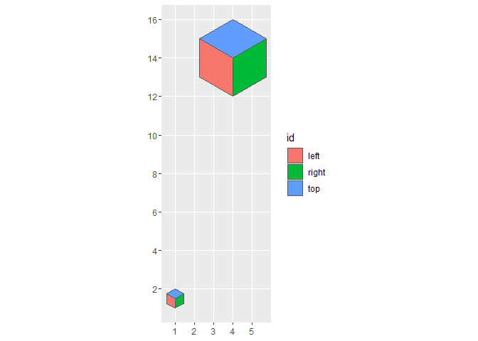
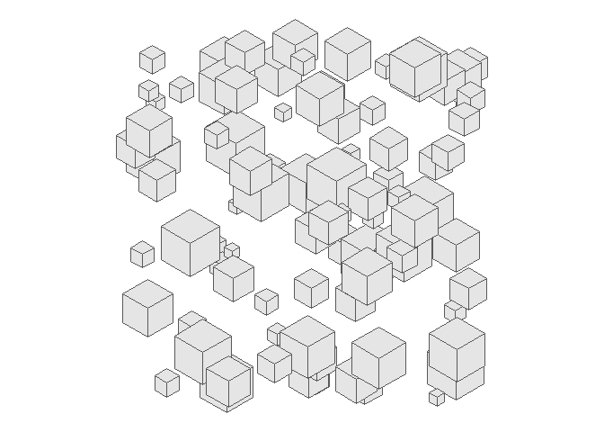
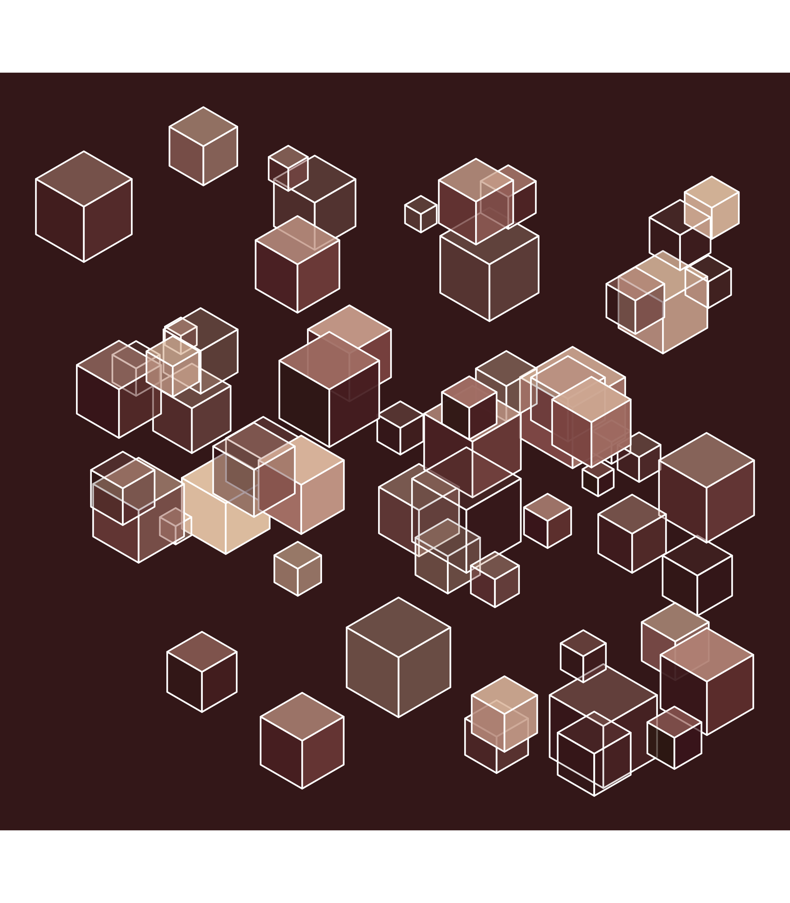

<!-- README.md is generated from README.Rmd. Please edit that file -->

# cubescapes

<!-- badges: start -->
<!-- badges: end -->

Cubes! Cubes in a cubescape.

I use these packages:

``` r
library(dplyr) # A Grammar of Data Manipulation
#> 
#> Attaching package: 'dplyr'
#> The following objects are masked from 'package:stats':
#> 
#>     filter, lag
#> The following objects are masked from 'package:base':
#> 
#>     intersect, setdiff, setequal, union
library(ggplot2) # Create Elegant Data Visualisations Using the Grammar of Graphics
library(glue) # Interpreted String Literals
library(MetBrewer) # Color Palettes Inspired by Works at the Metropolitan Museum of Art
library(MexBrewer) # Color Palettes Inspired by Works of Mexican Muralists
#> Registered S3 method overwritten by 'MexBrewer':
#>   method        from     
#>   print.palette MetBrewer
library(purrr) # Functional Programming Tools
library(sf) # Simple Features for R
#> Linking to GEOS 3.9.1, GDAL 3.4.3, PROJ 7.2.1; sf_use_s2() is TRUE
```

Create a function to generate the faces of an isometric cube “up”
direction:

``` r
cube_up <- function(x, y){
  face_1 <- matrix(c(x, y, 
                     x-sqrt(3)/2, y + 1/2,
                     x -sqrt(3)/2, y + 1 + 1/2,
                     x, y + 1,
                     x, y),
                   ncol = 2,
                   byrow = TRUE)
  
  # Convert coordinates to polygons and then to simple features
  face_1 <- data.frame(id = "left",
                       geometry = st_polygon(list(face_1)) %>% 
                         st_sfc()) %>% 
    st_as_sf()
  
  # Face 2
  face_2 <- matrix(c(x, y,
                     x, y + 1,
                     x + sqrt(3)/2, y + 1 + 1/2,
                     x + sqrt(3)/2, y + 1/2,
                     x, y),
                   ncol = 2,
                   byrow = TRUE)
  
  # Convert coordinates to polygons and then to simple features
  face_2 <- data.frame(id = "right",
                       geometry = st_polygon(list(face_2)) %>% 
                         st_sfc()) %>% 
    st_as_sf()
  
  # Face 3
  face_3 <- matrix(c(x, y + 1,
                     x - sqrt(3)/2, y + 1 + 1/2,
                     x, y + 2,
                     x + sqrt(3)/2, y + 1 + 1/2,
                     x, y + 1),
                   ncol = 2,
                   byrow = TRUE)
  
  # Convert coordinates to polygons and then to simple features
  face_3 <- data.frame(id = "top",
                       geometry = st_polygon(list(face_3)) %>% 
                         st_sfc()) %>% 
    st_as_sf()
  
  rbind(face_1,
        face_2,
        face_3)
}
```

Test function:

``` r
cube_1 <- cube_up(2, 2)
cube_2 <- cube_up(2, 6)

ggplot() +
  geom_sf(data = cube_1 |>
            mutate(geometry = geometry * 0.5),
          aes(fill = id)) + 
  geom_sf(data = cube_2 |>
            mutate(geometry = geometry * 2),
          aes(fill = id)) 
```

<!-- -->

Randomly sample a value to obtain a random seed:

``` r
seed <- sample(100000000, 1)
```

Select the number of cubes:

``` r
n_cube <- runif(1, 
                min = 50, 
                max = 100)
```

Create n_cube cubes:

``` r
# Collect elements for assembling the mosaic
x_c <- rep(0, n_cube)
y_c <- rep(0, n_cube)

## NOTE: purrr does not like it when .id is used, complains that geometry column not present: why?

cubescape <- purrr::pmap_dfr(list(x_c, y_c), 
                             cube_up, 
                             .id = "id")
```

<!--
Interesting bug, translating by one dimension

```r
cubescape <- cubescape |>
  mutate(geometry = (geometry * scale_p) + c(df$x))
#,
#         c_alpha = rep(runif(n_cube),
#                       each = 3),
#         fill = runif(n_cube))
```
--->

Basic plot:

``` r
# Create random translations for the cubes
c_trans <- data.frame(x = rep(runif(n_cube, min = 0, max = 20),
                              each = 3), 
                      y = rep(runif(n_cube, min = 0, max = 20),
                              each = 3)) |>
  st_as_sf(coords = c("x", "y"))

# Plot cube
cubescape |>
  mutate(scale_p = rep(runif(n_cube,
                             min = 0.5,
                             max = 2),
                       each = 3),
         geometry = (geometry * scale_p) + c_trans$geometry) |>
  ggplot() +
  geom_sf() +
  theme_void() +
  theme(legend.position = "none")
```

<!-- -->

Fill, remove the lines:

``` r
cubescape |>
  mutate(scale_p = rep(runif(n_cube,
                             min = 0.5,
                             max = 2),
                       each = 3),
         geometry = (geometry * scale_p) + c_trans$geometry,
         c_alpha = rep(runif(n_cube),
                       each = 3),
         fill = rep(runif(n_cube), each = 3),
         fill_f = rep(c(0.1, 1, 0.6), n_cube)) |>
  ggplot() +
  geom_sf(aes(fill = fill),
          color = NA) +
  theme_void() + 
  theme(legend.position = "none")
```

<!-- -->

Fill and add transparency:

``` r
cubescape |>
  mutate(scale_p = rep(runif(n_cube,
                             min = 0.5,
                             max = 2),
                       each = 3),
         geometry = (geometry * scale_p) + c_trans$geometry,
         alpha = rep(runif(n_cube),
                       each = 3),
         fill = rep(runif(n_cube), each = 3)) |>
  ggplot() +
  geom_sf(aes(fill = fill,
              alpha = alpha),
          color = NA) +
  theme_void() + 
  theme(legend.position = "none")
```

<!-- -->

Fill and add transparency; also lines for the boundaries:

``` r
cubescape |>
  mutate(scale_p = rep(runif(n_cube,
                             min = 0.5,
                             max = 2),
                       each = 3),
         geometry = (geometry * scale_p) + c_trans$geometry,
         alpha = rep(runif(n_cube),
                       each = 3),
         fill = rep(runif(n_cube), each = 3)) |>
  ggplot() +
  geom_sf(aes(fill = fill,
              alpha = alpha),
          color = "white") +
  theme_void() + 
  theme(legend.position = "none")
```

<!-- -->

Adjust the fill:

``` r
cubescape |>
  mutate(scale_p = rep(runif(n_cube,
                             min = 0.5,
                             max = 2),
                       each = 3),
         geometry = (geometry * scale_p) + c_trans$geometry,
         alpha = rep(runif(n_cube),
                       each = 3),
         fill = rep(runif(n_cube), each = 3),
         fill_adj = rep(c(1, 0.7, 0.3), n_cube)) |>
  ggplot() +
  geom_sf(aes(fill = fill * fill_adj,
              alpha = alpha),
          color = "white") +
  theme_void() + 
  theme(legend.position = "none")
```

<!-- -->

Change the palette:

``` r
# Set seed
set.seed(seed = seed)

# Translation of coordinates
c_trans <- data.frame(x = rep(runif(n_cube, min = 0, max = 20),
                              each = 3), 
                      y = rep(runif(n_cube, min = 0, max = 20),
                              each = 3)) |>
  st_as_sf(coords = c("x", "y"))

# Select collection of color palettes
edition <- sample(c("MexBrewer", "MetBrewer"), 1)

if(edition=="MexBrewer"){
  # Randomly select a color palette (MexBrewer Edition)
  palette_name <- sample(c("Alacena", "Atentado", "Aurora", "Concha", "Frida", "Revolucion", "Ronda", "Tierra"), 1)
  # col_palette <- mex.brewer(palette_name, n = 25)
  col_palette <- mex.brewer(palette_name)
  
}else{
  # Randomly select a color palette (MetBrewer Edition)
  palette_name <- sample(c("Archaumbault", "Austria", "Benedictus", "Cassatt1", "Cassatt2", "Cross", "Degas", "Demuth", "Derain", "Egypt", "Gauguin", "Greek", "Hiroshige", "Hokusai1", "Hokusai2", "Hokusai3", "Homer1", "Homer2", "Ingres", "Isfahan1", "Isfahan2", "Java", "Johnson", "Juarez", "Kandinsky", "Klimt", "Lakota", "Manet", "Monet", "Moreau", "Morgenstern", "Nattier", "Navajo", "NewKingdom", "Nizami", "OKeeffe1", "OKeeffe2", "Paquin", "Peru1", "Peru2", "Pillement", "Pissaro", "Redon", "Renoir", "Robert", "Signac", "Tam", "Tara", "Thomas", "Tiepolo", "Troy", "Tsimshian", "VanGogh1", "VanGogh2", 'VanGogh3', "Veronese", "Wissing"), 1)
  col_palette <- met.brewer(palette_name)
}

# Create the cubescape
cubescape |>
  mutate(scale_p = rep(runif(n_cube,
                             min = 0.5,
                             max = 2),
                       each = 3),
         geometry = (geometry * scale_p) + c_trans$geometry,
         alpha = rep(runif(n_cube),
                       each = 3),
         fill = rep(runif(n_cube), each = 3),
         fill_adj = rep(c(1, 0.7, 0.3), n_cube)) |>
  ggplot() +
  geom_sf(aes(fill = fill * fill_adj,
              alpha = alpha),
          color = "white") +
  scale_fill_gradientn(colors = col_palette) +
  theme_void() + 
  theme(legend.position = "none",
        panel.background = element_rect(fill = sample(col_palette, 1),
                                        color = NA))

# Save image
ggsave(glue("outputs/cubescape-{seed}.png"),
       #width = 8,
       height = 8,
       units = "in")
#> Saving 7 x 8 in image
```


